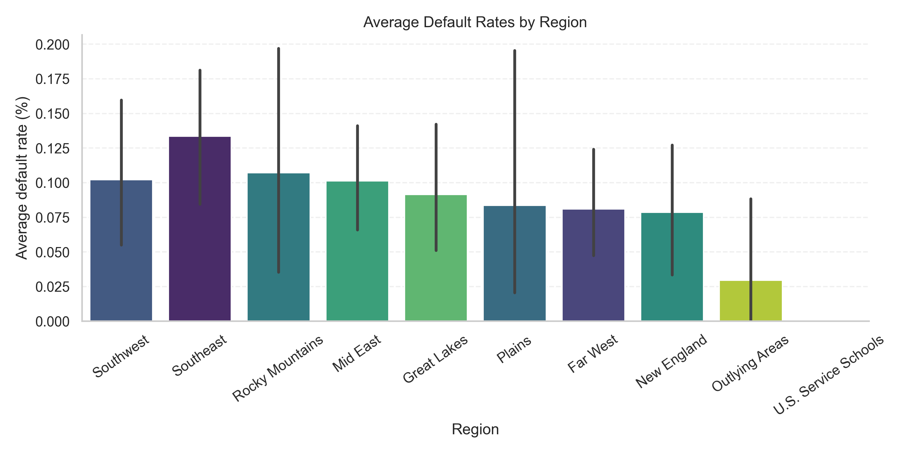
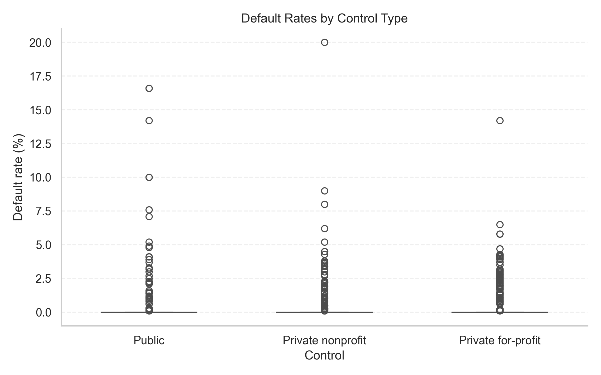
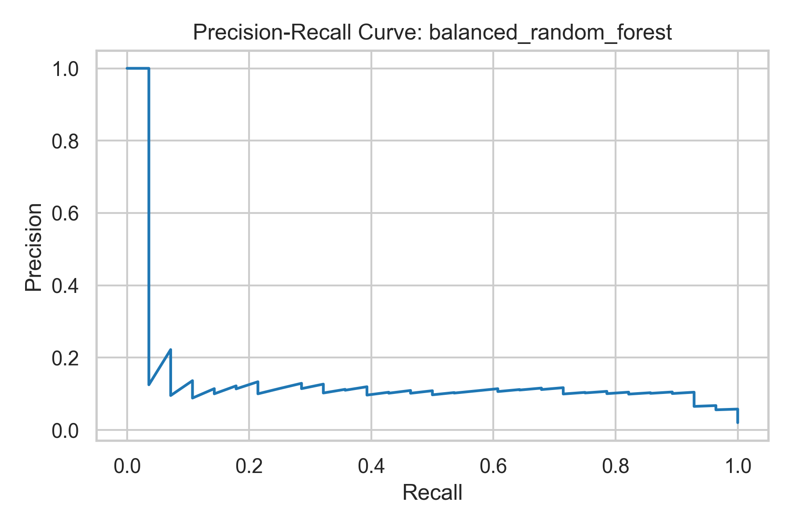

# Student Loan Risk Analysis

End-to-end Python project analyzing U.S. College Scorecard data to uncover drivers of student-loan defaults, visualize risk patterns, and score institutions with multiple imbalanced-learning models.

## Highlights
- **Rich feature engineering:** blends Scorecard academics/costs/demographics with SAIPE income/poverty and program clusters to derive completion, diversity, and affordability indicators.
- **Balanced modeling:** trains Random Forest, Balanced Random Forest, and SMOTE + Logistic Regression, exporting metrics, PR/ROC curves, recommended thresholds, and per-model watchlists.
- **Operational tooling:** includes loggable pipeline runner, FastAPI service for serving scores, watchlist/report generators, and CLI metric monitors for CI alerts.

## Data Sources
1. **College Scorecard (Most Recent Cohorts)** — institutions dataset downloaded from the U.S. Department of Education (April 17, 2025 refresh).
2. **SAIPE 2022 Estimates** — state-level poverty rates and median household income from the U.S. Census Bureau.

## Repository Layout
```
data/
  raw/                 # original College Scorecard archive + SAIPE workbook
  processed/           # enriched dataset and per-model risk score parquet files
figures/               # EDA plots + PR/ROC visuals
reports/
  model_metrics.json   # metrics, thresholds, watchlists
  watchlist_*.csv      # high-risk institutions per model
  deployment_plan.md   # automation & ops guidance
scripts/
  run_pipeline.ps1     # scheduled job entrypoint with logging
src/
  student_loan_default_analysis.py   # main pipeline
  api/server.py                      # FastAPI endpoints
  tools/monitor_metrics.py           # CI alert helper
  tools/watchlist_report.py          # markdown summary generator
```

## Quick Start
```bash
# 0) Fetch the (ignored) College Scorecard file(s)
python scripts/download_scorecard_data.py  # adds data/raw/scorecard/public/Most-Recent-Cohorts-Institution.csv

# 1) Install dependencies (Python 3.11+)
pip install -r requirements.txt  # or pip install pandas seaborn matplotlib scikit-learn imbalanced-learn fastapi uvicorn

# 2) Run the pipeline
python src/student_loan_default_analysis.py

# 3) Generate watchlist summary (optional)
python src/tools/watchlist_report.py
```

Raw downloads intentionally live outside of Git (see `data/raw/README.md`) so
the repository stays below GitHub's 100 MB per-file limit.

Artifacts land in `data/processed/`, `reports/`, and `figures/`. Most recent metrics + recommended thresholds live in `reports/model_metrics.json`.

## Automation & Monitoring
- **Scheduled job:** `scripts/run_pipeline.ps1` wraps the pipeline and writes logs under `logs/`. Point Windows Task Scheduler or CI at this script.
- **Metrics alerts:** `python src/tools/monitor_metrics.py` exits non-zero if recall or ROC-AUC fall below configured tolerances; wire it into CI for notifications.
- **FastAPI service:** `uvicorn src.api.server:app --reload` exposes `/models`, `/watchlist/{model}`, and `/institution/{unitid}` for integrations.

## Watchlists & Reporting
- Watchlists live in `reports/watchlist_<model>.csv` with matching risk scores in `data/processed/<model>_risk_scores.parquet`.
- `reports/watchlist_summary.md` (via `watchlist_report.py`) gives leadership-ready bullet points and sample flagged institutions per model.
- Deployment/ops guidance is summarized in `reports/deployment_plan.md` (no Power BI dependency).

## Sample Visuals







## Next Ideas
- Push artifacts to cloud storage (S3/Azure) + wire into your preferred BI tool.
- Extend the FastAPI app with authentication and historical comparisons.
- Add county- or tract-level socioeconomic enrichments for finer-grained insights.

## Raw Data Policy
- `data/raw/` is ignored in Git; use `python scripts/download_scorecard_data.py --help`
  to pull DOE files on-demand into `data/raw/scorecard/public/`.
- `data/raw/README.md` documents manual download instructions and available bundles.
- Keep ZIP archives outside the repo (e.g., `~/Downloads/scorecard/`) to prevent
  accidentally staging multi-hundred-megabyte files.

